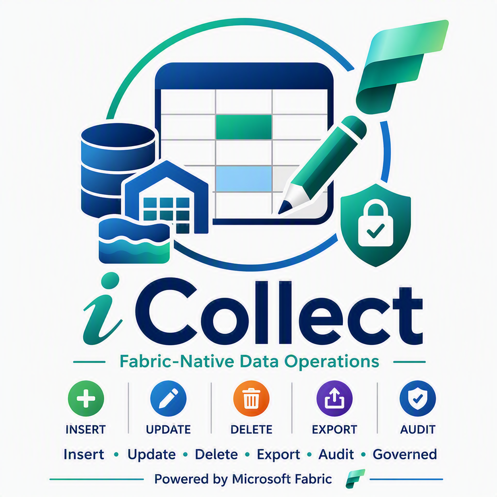
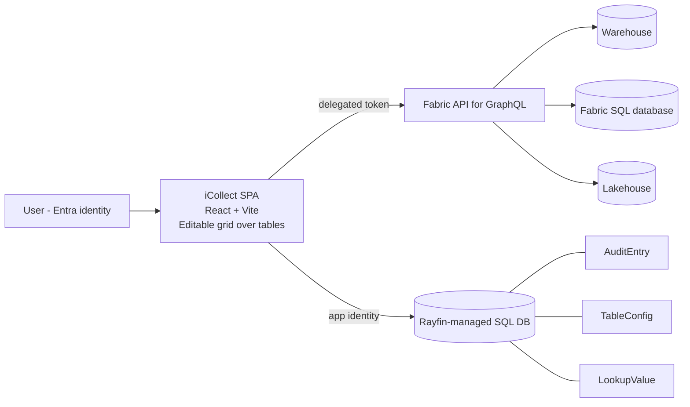

# iCollect



iCollect turns Microsoft Fabric into a platform where operational data is maintained, not
only read. It puts a governed, editable grid over tables that already live in a Fabric
**Warehouse**, **SQL database**, or **Lakehouse**, so the people closest to the data can
insert, correct, delete, and export records without a bespoke application standing in the
way.

Every action lands in a tamper-resistant audit log, and Fabric permissions remain the
security boundary. iCollect never grants access of its own: users see only the workspaces,
sources, and tables their own Fabric identity can already reach, because every request
carries their delegated token.

For a scene-by-scene walkthrough with a voice-over script, see [Demo.md](Demo.md).

---

## Contents

- [What it does](#what-it-does)
- [Benefits](#benefits)
- [Use cases](#use-cases)
- [Screens](#screens)
- [Architecture](#architecture)
- [Audit log](#audit-log)
- [Permission model](#permission-model)
- [Getting started](#getting-started)
- [Configuration](#configuration)
- [Deploying](#deploying)
- [Data model](#data-model)
- [Fabric platform constraints](#fabric-platform-constraints)
- [Troubleshooting](#troubleshooting)
- [Scripts](#scripts)

---

## What it does

| Capability | Detail |
|---|---|
| Fabric-native sign-in | Entra SSO, delegated tokens, no stored credentials |
| Cross-workspace browsing | Pick any workspace and GraphQL source you can see |
| Inline editing | Double-click a cell; saves through the source's update mutation |
| Typed cell editors | Date columns get a picker, numeric columns get a spinner, everything else is free text |
| Save feedback | Saved cells flash green, rejected cells flash red, and the flash survives the reload |
| Insert and delete | Gated on the source exposing create and delete mutations |
| CSV bulk upload | Row-per-line import, with a generated template matching the schema |
| Export | CSV and JSON, honouring the grid's active filters |
| Search, filter, sort | Global search, per-column filters, click-to-sort |
| Duplicate key check | App-side pre-insert check (see [constraints](#fabric-platform-constraints)) |
| Audit trail | Insert, update, delete, export, view, and page access |
| Audit time filter | Presets from the last 24 hours to the last year, plus a custom date range |
| Personal activity view | The Audit screen opens on your own actions; admins can widen it to everyone |
| Home dashboard | Quick actions plus your recent inserts, updates, deletes, and exports |
| Admin configuration | Per-table switches that narrow what iCollect will write |
| Custom naming | App name and table labels are configurable |

---

## Benefits

| Benefit | What it means in practice |
|---|---|
| Write back directly to Fabric | Insert, update, delete, and export against a Warehouse, SQL database, or Lakehouse through the Fabric API for GraphQL. No custom CRUD application to build or maintain. |
| Spans every workspace you can reach | One experience covers all workspaces and GraphQL sources your identity can see, instead of a separate tool per source. |
| No second permission model | There is no user store, role table, or access list to keep in step with Fabric. Users read and change exactly what Fabric already permits. |
| Fewer spreadsheets and shadow databases | Disconnected Excel files and manual re-upload cycles give way to governed updates recorded at the source. |
| Evidence for compliance reviews | Column-level before and after values, the actor, and a timestamp for every change, held in an insert-and-read-only store that the audited users cannot rewrite. |
| Analytics and AI read fresh data | Reports, dashboards, and copilots query the same tables the corrections land in, so a fix is visible without waiting for a reload pipeline. |
| Configuration in place of development | Point iCollect at a GraphQL source, set the per-table switches, and the data entry experience exists. |

---

## Use cases

| Scenario | How iCollect handles it |
|---|---|
| A data quality report flags mis-keyed rows in a Warehouse table | The analyst opens the table, filters to the affected rows, and corrects cells inline. Each edit records the column, the previous value, and the new one. |
| A record has to be created between scheduled loads | With inserts enabled on that table, the New row form collects every column and writes through the source's create mutation. |
| A month of readings arrives as a spreadsheet | Download the CSV template generated from the live schema, populate it, and bulk upload. Rows are checked for duplicate keys before insert. |
| A downstream team asks for a filtered extract | Apply search, per-column filters, and sort, then export CSV or JSON containing exactly the rows on screen. The export is itself audited. |
| An auditor asks who changed a value and when | The Audit screen carries the same search, filter, and sort behaviour as the grid, so the trail narrows by table, action type, actor, or date. |
| A table must stay read-only this quarter | An admin clears the insert, update, or delete switch for that table. The grid hides the affected controls, and the switches can only narrow what the source already allows. |

---

## Screens

### Home

The landing route. Four quick actions cover the rest of the app, a short panel explains the
guardrails, and "Your recent changes" summarises what you inserted, updated, deleted, or
exported over the last thirty days. That list groups a multi-column edit into a single line,
so a twelve-column correction reads as one row changed rather than twelve.

### Data

Workspace and source pickers, an Edit mode switch, a tab per enabled table, and the
editable grid. The information button beside the toolbar opens the table profile. Template
and Bulk Upload appear only while Edit mode is on and the table accepts inserts. Export
sits at the far end of the toolbar and respects whatever filters are active.

### Audit

The activity log: who did what, to which table, and when. It opens on your own actions for
the last seven days. Action types are colour coded, each column header carries its data
type, and the grid has the same search, filter, and sort behaviour as the Data screen.

### Admin

One row per table, showing the key columns iCollect detected and the operations the source
actually supports. Switches let you narrow those permissions; they can never widen them.
Clicking a table name opens a profile dialog with its backing data source and column list.
An Administrators section below the table list names who may reach this page at all.
The nav item is hidden, and the route redirects, for everyone else.

> **Screenshots.** Capture these from a running instance, save them to `docs/images/` with
> the filenames below, then uncomment the image block that follows.
>
> **Redact the signed-in account first.** The header shows the user's email and the audit
> grid repeats it on every row. Blur or crop in an image editor. Masking the text in the
> browser's DOM does not survive React's next render.
>
> | File | Route | Suggested state |
> |---|---|---|
> | `docs/images/home.png` | `/` | Recent changes populated |
> | `docs/images/data.png` | `/data` | A table open, one filter applied |
> | `docs/images/audit.png` | `/audit` | Several action types visible |
> | `docs/images/admin.png` | `/admin` | Table list with switches |
> | `docs/images/table-profile.png` | `/admin` | Profile dialog open |

<!--


-->

---

## Architecture

iCollect spans two storage systems, for reasons that matter:



**Business data** stays where it already lives. A browser cannot speak TDS on port 1433, so
the Fabric **API for GraphQL** is the only reachable surface for a Warehouse or SQL
database. Every call carries the user's delegated token, so Fabric enforces access.

**Application data** — the audit log, admin configuration, and dropdown values — lives in
the Rayfin-managed database that ships with the app. Keeping the audit log out of the
Warehouse is deliberate: it is declared insert-and-read only, so the users being audited
cannot rewrite or erase their own trail.

### Key source files

| Path | Responsibility |
|---|---|
| `src/services/fabricAuth.ts` | MSAL sign-in, token acquisition per resource |
| `src/services/fabricDiscovery.ts` | Workspace/item listing, GraphQL endpoint, source bindings, workspace users |
| `src/services/fabricGraphql.ts` | Schema introspection, row read and write |
| `src/services/auditService.ts` | Writes and reads the activity log |
| `src/services/tableConfigService.ts` | Admin switches, audited on change |
| `src/services/adminService.ts` | Administrator membership, audited on change |
| `src/services/exportService.ts` | CSV/JSON serialisation and parsing |
| `src/auditStyles.ts` | Single colour per action type, shared by Audit and Home |
| `src/hooks/AdminContext.tsx` | Loads the administrator list and answers `isAdmin` app-wide |
| `src/hooks/useStatus.ts` | Busy/notice/error state behind every long-running action |
| `src/components/DataGrid.tsx` | Grid, inline editing, search/filter/sort, save flash |
| `src/components/AdminUsers.tsx` | Administrator search, add, and remove |
| `src/components/ValueEditor.tsx` | Chooses a date, number, or text editor from the column scalar |
| `src/components/TimeRangeFilter.tsx` | Audit presets and custom date range |
| `src/components/RecentActivity.tsx` | "Your recent changes" on the Home page |
| `src/components/StatusBanner.tsx` | Renders the `useStatus` result |
| `src/components/ErrorBoundary.tsx` | Surfaces render failures instead of a blank page |
| `rayfin/data/*.ts` | Entity definitions for the app-owned database |

---

## Audit log

Every action iCollect performs is recorded. Actions taken **outside** the app — directly in
the Warehouse, in SQL, or via any other tool — are invisible to it.

| Action type | Recorded when | Colour |
|---|---|---|
| `insert` | A row is created, one entry per populated column | green |
| `update` | A cell is edited, with old and new values | blue |
| `delete` | A row is removed, capturing its final state | red |
| `export` | CSV or JSON leaves the app, with format and row count | purple |
| `view` | A table's rows are first loaded in a session | grey |
| `login` | A page is opened, recording the route | amber |

Columns: `actionedAt`, `actionedBy`, `actionType`, `tableName`, `rowKey`, `columnName`,
`oldValue`, `newValue`.

Whole-table actions (`export`, `view`, `login`) have no single row or column, so `rowKey`
and `columnName` are recorded as `*`.

Configuration changes are audited alongside data changes. A switch on the Admin page lands
under `tableName` `TableConfig`, and naming or removing an administrator lands under
`AppAdmin`, in both cases with the affected table or person in `rowKey`.

Notes on volume, since an audit log that floods is an audit log nobody reads:

- `view` fires **once per table per session**, not on every re-render.
- `login` fires **once per distinct route**, deduped across the layout's remounts.
- Viewing the Audit page itself is not recorded, to avoid a log that grows purely from
  being read. Exporting it **is** recorded.

### Reading the trail

The Audit screen queries the log rather than filtering a full download, so two controls
decide what comes back from the server.

| Control | Default | Effect |
|---|---|---|
| Time filter | Last 7 days | Presets for 24 hours, 7, 15, and 30 days, 6 months, and 1 year, plus a custom start and end date |
| Show others | Off | Restricts the query to your own `actionedBy`. Only rendered for admins |

A single edit writes one entry per changed column, so a query is capped at 1000 rows to
keep the page responsive. A wide time range over a busy month can hit that ceiling and
return only the most recent entries. Narrow the range when the count looks short.

> [!IMPORTANT]
> Scoping the view to your own rows is a convenience, not an access control. `AuditEntry`
> grants `read` to every authenticated user, so the whole trail remains reachable through
> the data plane. Enforcing per-user visibility would need a server-side filter.

---

## Permission model

Three gates, applied in order. Each can only narrow the previous one.

1. **Fabric permissions.** The user's delegated token decides which workspaces, sources,
   and tables are visible at all.
2. **Source capability.** iCollect introspects the GraphQL schema. A table with no primary
   key gets no update or delete mutation, so those operations are impossible regardless of
   configuration.
3. **Admin switches.** `TableConfig` narrows what iCollect is willing to write. Switches for
   unsupported operations are disabled and force-cleared.

```text
canUpdate = configuredAllowUpdate AND sourceHasUpdateMutation
```

If a table shows as read-only, the usual cause is a missing primary key. Add one, then
refresh the GraphQL API:

```sql
ALTER TABLE dbo.my_table
  ADD CONSTRAINT PK_my_table PRIMARY KEY NONCLUSTERED (my_id) NOT ENFORCED;
```

A table the admin has not marked **Enabled** does not appear on the Data page at all.
Visibility is opt-in, so a source with no `TableConfig` rows yet shows nothing until an
admin turns tables on.

### Who counts as an admin

Administrators are named on the Admin page and stored in the `AppAdmin` entity.
Candidates come from the selected workspace's Fabric role assignments, so only somebody
Fabric already knows can be named. While the list is empty every signed-in user is an
administrator, which keeps the app usable before anyone has claimed it. Naming the first
administrator immediately takes the Admin page away from everyone else.

Administrators see the Admin nav item and the `/admin` route, and they alone get the **Show
others** toggle on the Audit page. Both checks run in the browser, so they decide what the
UI offers rather than what the data plane permits.

> [!IMPORTANT]
> `AppAdmin` grants `create`, `read`, and `delete` to every authenticated user, so a
> determined user can name themselves through the data plane. Treat this as delegation
> among trusted colleagues, not as a privilege boundary.

---

## Getting started

### Prerequisites

- Node.js 20, 22, or 24 (the Rayfin CLI declares these; newer majors emit `EBADENGINE`)
- A Fabric workspace with a Warehouse or SQL database
- A Fabric **API for GraphQL** item bound to that source, exposing the operations you need
- An Entra **single-page application** registration

### Install and run

```bash
npm install
npm run dev
```

`predev` regenerates `.env.local` from `rayfin/.env`. Never hand-edit `.env.local`.

### Entra app registration

Register these as **Single-page application** redirect URIs:

```text
http://localhost:5173/auth-redirect.html
https://<your-app>.webapp.fabricapps.net/auth-redirect.html
```

Grant admin consent for these delegated permissions:

| Scope | Used for |
|---|---|
| `https://analysis.windows.net/powerbi/api/GraphQLApi.Execute.All` | Running queries and mutations |
| `https://api.fabric.microsoft.com/Workspace.Read.All` | Listing workspaces, and the workspace users offered as administrator candidates |
| `https://api.fabric.microsoft.com/Item.Read.All` | Listing items in a workspace |
| `https://api.fabric.microsoft.com/Item.ReadWrite.All` | Reading the API definition for source bindings |

Entra issues one audience per token, so the Power BI and Fabric scopes are requested
separately — they cannot be combined into a single request.

The redirect URI must point at `auth-redirect.html`, a dedicated page that runs MSAL's
redirect bridge. Pointing it at the app origin will hang the sign-in popup.

---

## Configuration

Root `.env`:

```bash
VITE_FABRIC_GRAPHQL_CLIENT_ID=<entra-spa-client-id>
VITE_APP_NAME=iCollect
```

`VITE_APP_NAME` sets both the browser tab title and the header. `VITE_FABRIC_TENANT_ID`
comes from the generated `.env.local`.

Administrators are not configured here. They are named on the Admin page and stored in the
database, so the list survives a redeploy and does not need a rebuild to change.

---

## Deploying

Run from the **project root**. Running from the parent folder exits with code 1.

```bash
npx tsc -b                    # type-check
npx rayfin up db apply --yes  # apply entity schema changes
npx rayfin up --yes           # build and deploy static content
```

`rayfin up` alone does **not** apply schema migrations — `db apply` is a separate step.

Renaming or removing an entity field is destructive and will be refused:

```text
Performing Rename column 'x' to 'y' ... would result in data loss
but force mode is not enabled.
```

Adding a field or extending a `@set` enum applies cleanly without `--force`. Only reach for
`--force` when you accept losing the affected column's data.

Each deploy emits new content-hashed bundles. If a page loads blank with the tab title
still showing, a cached `index.html` is requesting a bundle that no longer exists — hard
refresh.

---

## Data model

Four entities in the Rayfin-managed database, defined in `rayfin/data/`.

### AuditEntry — `create`, `read`

Insert-and-read only, which is what makes the trail trustworthy.

| Field | Type | Notes |
|---|---|---|
| `id` | uuid | |
| `sourceKey` | text(200) | `{workspaceId}/{itemId}` |
| `schemaName` | text(128) | Source schema, for example `dbo` |
| `tableName` | text(128) | |
| `rowKey` | text(900) | JSON of key columns, or `*` |
| `columnName` | text(128) | Or `*` |
| `oldValue` | text(4000), optional | |
| `newValue` | text(4000), optional | |
| `actionType` | set | insert, update, delete, export, view, login |
| `actionedBy` | text(256) | |
| `actionedAt` | date | |

### TableConfig — `create`, `read`, `update`, `delete`

Admin switches: `isEnabled`, `allowInsert`, `allowUpdate`, `allowDelete`, plus the detected
`keyColumns`. Every change is audited, recording only the switches that moved.

### AppAdmin — `create`, `read`, `delete`

Who may reach the Admin page: `email`, `displayName`, `addedBy`, `addedAt`. An empty table
means everyone. Additions and removals are audited.

### LookupValue — `create`, `read`, `update`

Dropdown values captured from the grid's "add new value" affordance.

---

## Fabric platform constraints

Behaviour that surprises people, and is the platform's design rather than a bug:

- **Lakehouse SQL endpoints are read-only.** Only a Warehouse supports writes. Lakehouses
  are out of scope for editing.
- **Warehouse keys are `NOT ENFORCED`.** Primary and unique constraints are declarative
  only. The duplicate check therefore runs in the app and **cannot see a concurrent insert
  from another user**. Treat it as a convenience, not a guarantee.
- **Warehouse has no DEFAULT constraints.** Timestamps must be written explicitly.
- **`ALTER TABLE ADD` accepts nullable columns only** in a Warehouse.
- **No TDS from a browser.** The GraphQL API is the only path; a direct SQL connection is
  not possible from a static SPA.
- **Introspection cannot reveal the backing source.** The GraphQL schema exposes entities,
  not the warehouse behind them. iCollect reads the API item's definition to resolve it.

---

## Troubleshooting

| Symptom | Cause and fix |
|---|---|
| Blank page, tab title still shows | Cached `index.html` pointing at an old bundle. Hard refresh. |
| "does not expose an update operation" | Table has no primary key. Add one, refresh the GraphQL API. |
| Sign-in popup hangs | Redirect URI not registered, or not pointing at `auth-redirect.html`. |
| Binding shows as unavailable | `Item.ReadWrite.All` missing or not consented. |
| Audit page empty | No action has been taken *through the app* yet, or everything you did falls outside the time filter. Widen it before concluding the log is empty. |
| Audit page empty for an admin | "Show others" is off, so it is querying your own `actionedBy` only. |
| Admin menu missing | Somebody has been named an administrator and you are not one of them. |
| Cannot search users to name an administrator | Listing workspace role assignments needs the Member role or higher on that workspace. |
| Data page shows no table tabs | No table is marked Enabled for that source on the Admin page. |
| Data page tabs are stale after an Admin change | The Data page reads the configuration once on mount. Reload the page. |
| Render error panel | The error boundary caught a crash; the message and component stack identify it. |
| `rayfin` exits with code 1 | Run it from the project root, not the parent folder. |

---

## Privacy

The header shows the signed-in user's email, and the audit grid repeats it on every row.
That is the point of an audit trail, but it means **screenshots and CSV exports carry
personal data**. Redact before sharing externally, and treat exported audit files as
sensitive.

---

## Project structure

```text
├── rayfin/
│   ├── rayfin.yml          # Fabric service configuration (auth + static hosting)
│   └── data/               # Entity definitions for the app-owned database
│       ├── appAdmin.ts
│       ├── auditEntry.ts
│       ├── tableConfig.ts
│       ├── lookupValue.ts
│       └── schema.ts
├── src/
│   ├── main.tsx            # Entry point + Rayfin client bootstrap
│   ├── App.tsx             # Routes, auth gate, error boundary
│   ├── auth-redirect.ts    # MSAL redirect bridge (separate Vite entry)
│   ├── auditStyles.ts      # Action-type colours shared across screens
│   ├── hooks/
│   │   ├── AdminContext.tsx
│   │   ├── AuthContext.tsx
│   │   └── useStatus.ts
│   ├── components/
│   │   ├── AdminUsers.tsx
│   │   ├── AppLayout.tsx
│   │   ├── AuthPage.tsx
│   │   ├── DataGrid.tsx
│   │   ├── ErrorBoundary.tsx
│   │   ├── ExportMenu.tsx
│   │   ├── InfoTip.tsx
│   │   ├── PoweredBy.tsx
│   │   ├── RecentActivity.tsx
│   │   ├── StatusBanner.tsx
│   │   ├── TableProfileDialog.tsx
│   │   ├── TimeRangeFilter.tsx
│   │   ├── ValueEditor.tsx
│   │   └── Wordmark.tsx
│   ├── pages/
│   │   ├── HomePage.tsx
│   │   ├── DataPage.tsx
│   │   ├── AuditPage.tsx
│   │   └── AdminPage.tsx
│   └── services/
│       ├── fabricAuth.ts
│       ├── fabricDiscovery.ts
│       ├── fabricGraphql.ts
│       ├── auditService.ts
│       ├── tableConfigService.ts
│       ├── exportService.ts
│       ├── rayfinClient.ts
│       └── bootstrap.ts
├── auth-redirect.html
└── package.json
```

## Scripts

| Command | Description |
|---------|-------------|
| `npm run dev` | Deploy app to Fabric and start local dev server |
| `npm run build` | Production build |
| `npm run build:fabric` | Build for Fabric deployment (entrypoint for `rayfin up staticapp deploy`) |
| `npm run lint` | Lint with ESLint |
| `npm run test` | Run unit tests with Vitest |
| `npm run rayfin:up` | Deploy app to Fabric (no local dev server) |
